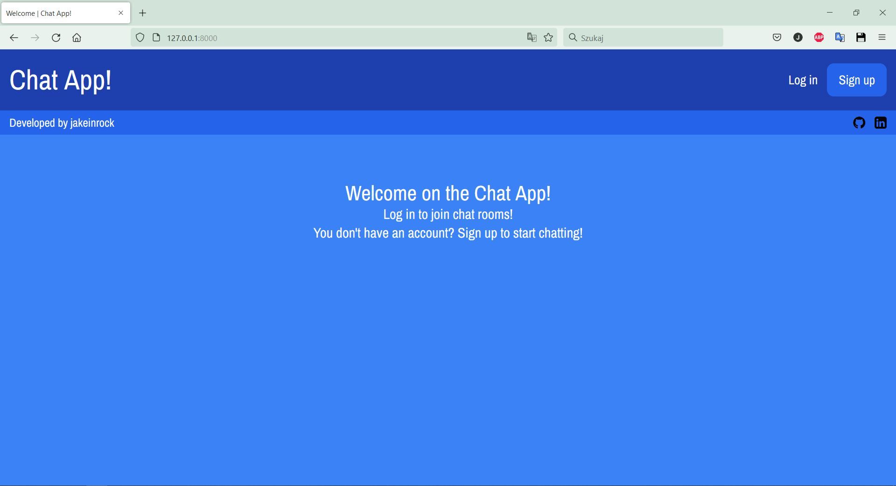
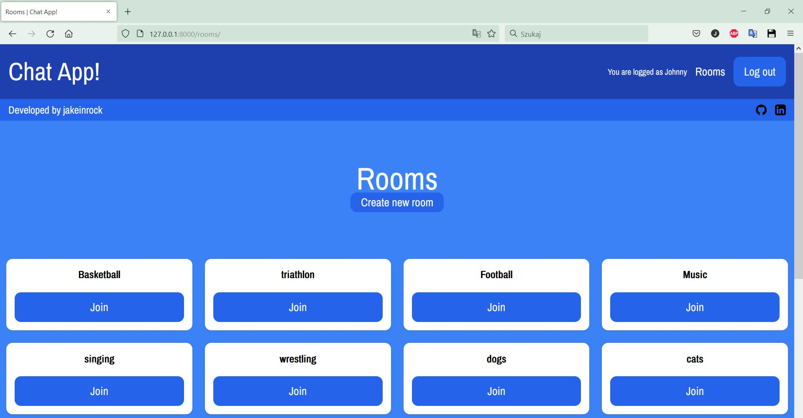
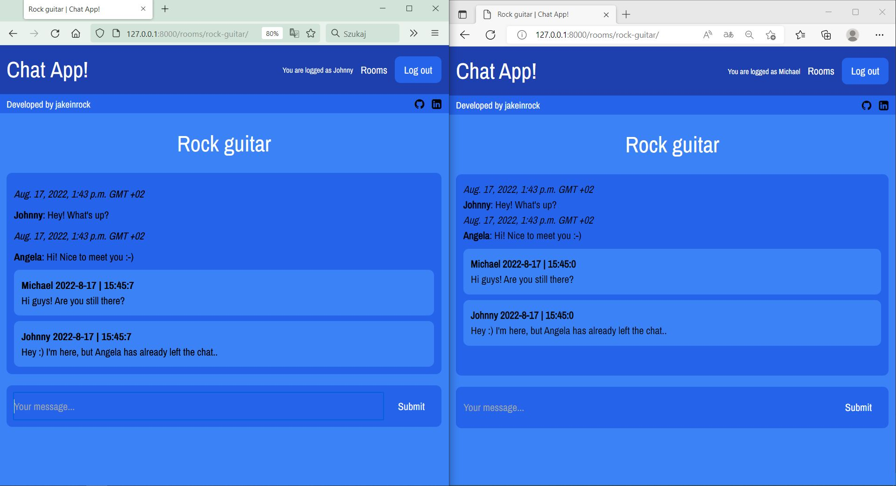

# Chat-App!

## Description
The Chat App! was built with use of HTTP and WebSocket protocols. The app enables users to join a chat and send messages in real time.

**Chat App! handles:**

* Creating account

* Creating and joining chats

* Sending messages in real time

* Reading the messages after the absence (messages are stored in database)

Technology stack used to create a project:

* **Development**

    Python, django-channels, channels-redis, Docker

* **Database**

    PostgreSQL

* **Test and Lint**

    flake8 (PEP8), GitHub Actions

* **Frontend**

    HTML

***

## Running the app

Requirements:

macOS, Linux or Windows machine capable of running Docker (This excludes Windows 10 Home)

To run the app, navigate to the project's root directory and run the following command:

    docker-compose up

When the app building process is finished you can access it at:

    http://127.0.0.1:8000/

***
